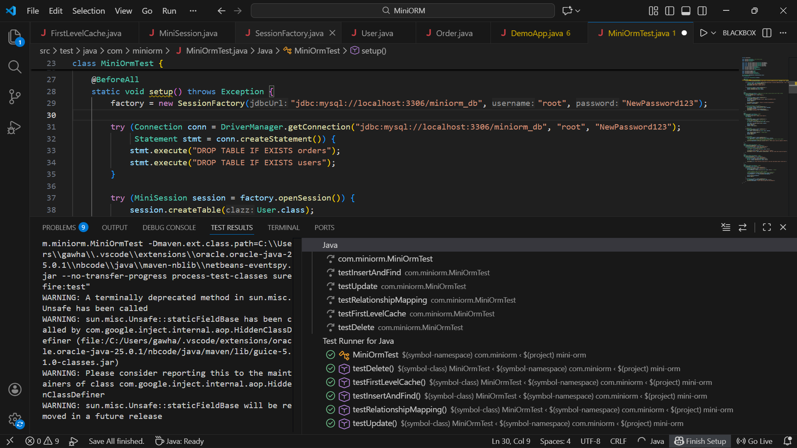

# MiniORM - Lightweight Custom Java ORM

A lightweight Object-Relational Mapping (ORM) framework built from scratch in Java. This project demonstrates the core mechanics of Hibernate, including **Reflection**, **JDBC Transaction Management**, and **First-Level Caching**.

##  Features
- **Custom Annotations**: `@Entity`, `@Id`, `@Column`, `@ManyToOne`.
- **Reflection Engine**: Auto-generates SQL (`CREATE`, `INSERT`, `SELECT`, `UPDATE`) at runtime.
- **First-Level Cache**: Prevents duplicate database hits within the same session.
- **Transaction Management**: Atomic `commit` and `rollback` support.
- **Relationship Mapping**: Supports `ManyToOne` eager loading.
- **Connection Pooling**: Integrated with HikariCP for production-grade performance.

##  Tech Stack
- **Language:** Java 17+
- **Build Tool:** Maven
- **Database:** MySQL
- **Connection Pool:** HikariCP
- **Logging:** SLF4J / Logback
- **Testing:** JUnit 5

##  Screenshots
### 1. Console Output (SQL Generation & Cache Hits)
> *Shows the ORM generating SQL and serving objects from the internal cache.*

### 2. Database Verification
> *Data persisted in MySQL (Users & Orders).*

### 3. Unit Test Success
> *JUnit 5 test suite passing all CRUD operations.*

